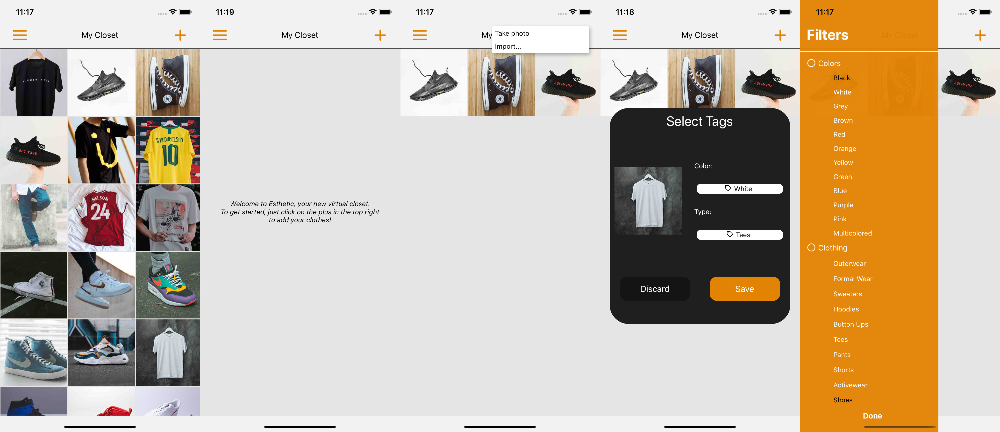

# Esthetic



A virtual closet application for Android and iOS.

Features:
* Upload photos of your clothing from your photo gallery, or take pictures directly within the app.
* Add color and clothing type tags to your uploaded clothing items. (Auto-tagging feature currently under development.)
* View your entire wardrobe, and filter through it by color or clothing type.

Software Development:
* Steven Docto

Product Management/ML Development:
* Johnson Lin

## Local Development

### Prerequisites

* React: 16.13.1
* React Native: 0.63.2

### Dependencies
* @react-native-async-storage/async-storage": "^1.13.2"
* @react-native-community/masked-view": "^0.1.10"
* @react-navigation/native": "^5.7.5"
* @react-navigation/stack": "^5.9.3"
* expo-image-picker": "^9.1.1"
* "react-native-camera": "^3.36.0"
* "react-native-device-info": "^5.6.3"
* "react-native-gesture-handler": "^1.8.0"
* "react-native-get-random-values": "^1.4.0"
* "react-native-popup-menu": "^0.15.9"
* "react-native-reanimated": "^1.13.1"
* "react-native-safe-area-context": "^3.1.9"
* "react-native-screens": "^2.11.0"
* "react-native-unimodules": "^0.11.0"
* "react-native-vector-icons": "^7.0.0"
* "uuid": "^8.3.0"

### Run the project in a simulator

```
$ git clone git@github.com:sjmdocto/esthetic.git
$ cd esthetic
$ cd ios && pod install
$ cd ..
$ yarn run ios // OR yarn run android
```
